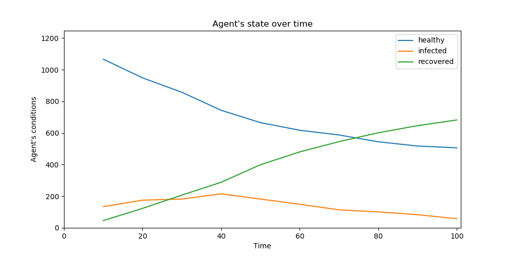
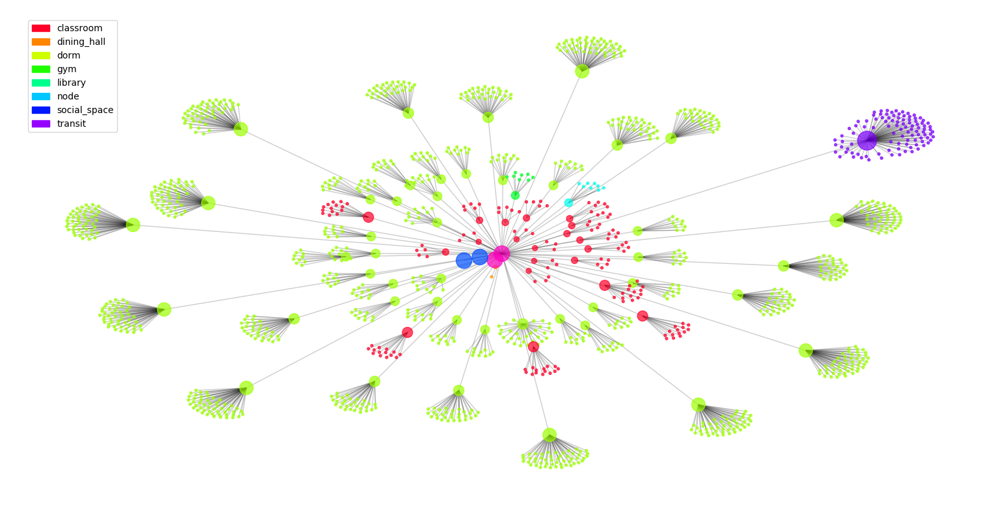

A# modeling_in_python
COVID model in python

---
 - [Dependencies](#depend)
 - [References to tricks used in my code](#refer)
 - [Definitions](#defin)
 - [How it works](#works)
     - [Configurations](#configurations)
         - [building.csv](#building)
         - [rooms.csv](#rooms)
         - [agents.csv](#agents)
         - [agent config](#ag_config)
     - [file_related.py](#file_related)
     - [corona.py](#corona)

---
 

## Dependencies
Libraries used in this model:
- Matplotlib
- Pandas
- Numpy
- network x
Python standard libraries used in this project:
- bisect
- random

## outputs:

---
 

## References to tricks used in my code:
OOP tricks in python:
- __slots__ (https://stackoverflow.com/questions/472000/usage-of-slots)
    - use different column names for every csv
refrence for people who wants to change the visuals
- https://stackoverflow.com/questions/14283341/how-to-increase-node-spacing-for-networkx-spring-layout

---

## Definitions

png of nodes and edges
- egde
- vertex
- directed vs undirected

---

 

## How it Works

This program impliments an agent-based modeling that allows configurable relationships between enclosed areas and autonomous agents.  The enclosed area is a class object that is an abstract representation of "rooms", whatever that means to the user.  The agent's movement within the "rooms" and their behaviors can be fully randomized, strictly scheduled, or anything in between.

The spread of COVID-19 is implimented in this project and if the user wants to model a new system, then they can make a new .csv and load it onto the model.

* the term "room" in the following paragraph includes structures like rooms, hallways, cafeteria, gym, parks, soccor fields, and any structures that have an abstract representation with capacity. *
In the COVID-19 model, we have clusters of rooms that represents a building and the agents move between the rooms and buildings.  The rooms have entry and exit points with adjacent rooms 

The infection model impliments buildings full of rooms and agents that move within the rooms. The building will have different rooms with configurable connections, and the connection represents paths that the agents can take to move to another room. The agent's behavior can be configured to take random or semi-defined schedules and they move between rooms that they're allowed to visit.   

### Explanation of Running the Code
<Insert Explanation Here>

### Explanation of Configuration files

 

### Buildings.csv
This file lists names of the buildings/containers that will contain the rooms

| building name |
|--|
| building A |
|...|
|   |

The term "Building" isn't 100% accurate, the term container is better.
In the implimentation where we model a school campus, "outside" is also considered a "building/container" that will contain "roads" that allow travel to a different "building"
 

### rooms.csv 

| room name | room capacity | located building | connected to | travel time | ... |
|-------------|---------------|------------------|--------------|-------------|-----|
|             |               |                  |              |             |     |
|               |               |               |               |           |       |   

Explanation of column value:
- **room name** : room name, the names doesn't need to be unique, but it is the best practice to make the name unique so that when you print/extract information, it is easy to interpt the data
- **room capacity** : int, defines the max number of agents that can be in the room
- **located building** : name of building which the room is contained in
- **connected to** : name of room which the current room is connected to.  If theres a connection between "Room A" and "Room B", and if "Room B" is contained in the "connected to" entry in the row for "Room A", then there's no need to make a row for "Room B" to "Room A". All conections are undirected edges.
- **travel time**:  non-negative integer, represents the time required to travel through the edge. 
* more columns can be added to the csv and if you want to use those newly added parameters modify the __init__() for the rooms class and call the new parameter in whatever function for effects to take place.

 

### Agents.csv

| random | name | age | immunity | initial condition | infected | archetypes |
|--------|------|-----|----------|-------------------|----------|------------|
|        |      |     |          |                   |          |            |
|       |       |   |           |                   |           |           |

Explanation of column value
- **random** : T or F, if this value is F, then the model will load the data in that row.  If the value is T, then it will make random values for the rest of 
- **name** : anything can go in this entry, repetition (same name) is allowed, and the name is just an entry to help distinguish agents
- **age** : like name, anything can be put in this entry.
- **immunity** : value in range [0, 1], defines the resistance of the agent, you can modify how this value will affect each other by modifying the infection_rule function in the main function.
- **initial condition** : name of any room or building that's in either building.csv or rooms.csv.  If the name of the building is given, then it will choose a random room in the building as it's initial spawn point. 
- **infected** : True or False, defines if the agent is infected with some disease, in this case the COVID-19 disease.
- **archetypes** : put in the archetype that corresponds to the specific agent.  This "archetype" can be configured in the agent_config.json, and depending on the value, the , you can make schedules restrictive by creating a archetype that only have few possible schedule.  more detail on how a schedule for each agent is chosen is written in the schedule section below.

 

### agents configuration and scheduling:

The agent's scedule can be assigned by making a schedule in the file or you can make the code randomly make a schedule from a list of possible options, an example of how it works is below:

from the config file, the code generates a table that looks like the following

| room name | archetypes | (start, end) |
|---|-----|----|
| room 101 | [ global ] | [(10:00AM, 11:00AM), (1:00PM, 2:30PM)] |
| room 102 | [ athletic ] | [(11:00AM, 11:59AM), (2:00PM, 3:PM)] |
| room 103 | [business major, athletic] | [(5:00PM,  6:00PM)] |

- the "archetypes" column contains archetypes given to the agents and if the agent's archetype is contained in that cell, then agents of that type can have the room built into their schedule,
- the term "global" in the archetypes column have a special meaning and it allows any agents to put it in their scedule.
- the (start, end) tuple is a scedule of the room. if an agent build a random scedule, then it will randomly choose a schedule with no overlapping time slots.

**Example**: a random schedule for an agent with the type "business major" will be made by taking disjoint time slots from room 101 and room 102, while "athletic" types can choose disjoint time intervals from all rooms.

 

### File_related.py
This python file contains functions related to opening and reading the csv files.  There are also some functions that reformats the data into a panda dataframe.

### corona.py

The main python file that have the code for the agents and rooms.  Creates, configures and simulate the model that is described in the csv file.

current parameters:
agents: 
- static: name, age, gender 
- influence schedule: archetype, 
- dynamic: immunity, state, motion_state, curr_location, arrival_time, travel_time, minimum_waiting_time, destination

rooms:
- static: room_name, capacity, limit
- dynamic: agents_in_room

buildings:
- static: room_list
- dynamic: building_param